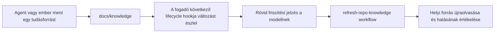

# Hookkal jelzett tudásfrissítés

Történeti kutatási jegyzet az implementáció előtti állapotról. A starter 1.1.0
aktuális megoldása és korlátai a [hookútmutatóban](../hooks.md) szerepelnek.

Állapot: **kutatási eredmény és javaslat**, nem elfogadott követelmény vagy telepített funkció.
Ellenőrizve: **2026-09-10**, Windows. A próbaprogramok a workshop külön
`a2a-compatibility-probe` könyvtárában vannak; nem részei a starter függőségeinek.

## Eredmény és javaslat

**Igen: hookkal érdemben javítható a futó session tudásfrissítése.** A modell
kontextusába adott rövid jelzésből a jelenlegi `refresh-repo-knowledge` workflow
elindulhat. Claude-nál ezt valódi modellel és tényleges forrásolvasással is mértük.
Codexnél a változást észlelő hook és az ugyanazon sessionben kiváltott modellkérés
közötti adatút működését igazoltuk, determinisztikus helyi API-val.

Az első kiegészítőt azonos checkoutban dolgozó sessionökre szűkíteném:

Ehhez első körben nem szükséges A2A, MCP vagy állandó háttérfolyamat. Ugyanazt
a fájlváltozást bármely támogatott fogadó ellenőrizheti, a feladó márkájától
függetlenül. Ez helyi tudásváltozás észlelése; célzott kérdés/válasz, másik
checkout eseménye és tartós kézbesítési nyugta a külön kommunikációs réteg feladata.

## Mi van már a starterben?

- [AGENTS.md](../../AGENTS.md): keresés, forrásolvasás és kontextusváltás utáni frissítés.
- [refresh-repo-knowledge](../../.agents/skills/refresh-repo-knowledge/SKILL.md):
  helyi források újraolvasása, ID/verzió/státusz/hatókör vizsgálata, tényleges hatás jelentése.
- [Tudásindex](../knowledge/INDEX.md) és [életciklus](../knowledge/README.md):
  a források és a javaslat/elfogadott döntés megkülönböztetése.
- A vizsgálat idején nem volt beépített hook, hash/cursor vagy eseményfolyam.

A hiányzó rész tehát a frissítés szükségességének gépi felismerése és jelzése.
A hook nem helyettesíti a meglévő tudáskezelési eljárást.

## Dokumentált hostviselkedés

| Esemény / kimenet | Mire használnánk? | Korlát |
| --- | --- | --- |
| `SessionStart` | Indulási ellenőrzés; resume/compaction után újraolvasási jelzés | A változatlan fájlhash nem bizonyítja, hogy a szükséges forrás még a modell kontextusában van |
| `UserPromptSubmit` | A következő felhasználói kérés előtti ellenőrzés | Önmagában nem értesít két felhasználói üzenet között |
| Szinkron `PostToolUse` + `additionalContext` | Változásjelzés munka közben | A támogatott eszközhívás után fut, nem szakít meg egy folyó modellkérést |
| Szinkron `Stop` | Lezáráskor észlelt változásnál korlátozott folytatás | Dedup és folytatási limit kell; nem időzített idle ébresztő |

Claude `FileChanged` figyelhet külső fájlírásra, de saját kimenete nem ad
`additionalContext`-et: a `systemMessage` rövid terminálértesítés, az SDK-streamben
sem jelenik meg. Önálló modellértesítési megoldásnak ezért nem választanám.
A dokumentált `asyncRewake` exit 2 mellett idle ébresztést is tud; ezt nem mértük,
és a normál tudásváltozást nem minősíteném háttérhibának csak az ébresztés kedvéért.
[Claude hook referencia](https://code.claude.com/docs/en/hooks).

Codexnél a háttérhook eredménye aktív turnben a következő biztonságos ponton
juthat a modellhez; idle állapotban a következő user turnig vár. A szinkron
`Stop` `decision: block` és `reason` válasza folytatást kérhet. Az
`additionalContext` fejlesztői kontextus, ezért ide rögzített, saját frissítési
jelzés kerüljön, ne egy másik agent tetszőleges üzenete.
[Codex hook referencia](https://learn.chatgpt.com/docs/hooks).

**A skill neve a hook kimenetében nem automatikus skillhívás.** A hook a modellt
irányítja a workflow-ra. A megfigyelt reakciót külön kell mérni; a sikeres
hookvégrehajtás önmagában nem forrásolvasás vagy feldolgozási nyugta.

## Helyi bizonyítékok

| Próba | Eredmény | Mit bizonyít? |
| --- | --- | --- |
| Claude Desktop 2.1.260 motor, helyi API | **11/11 ellenőrzés** | Valódi Read és PostToolUse, külső változás, jelzés, majd tényleges skill-/forrásolvasás; a lépéseket szkriptelt API választotta |
| Ugyanez valódi Claude-modellel | **8/8 ellenőrzés** | A modell a jelzésre elolvasta a kanonikus skillt, projektleírást, indexet és a friss döntést; helyesen jelentette a javasolt státuszt és a feladatra gyakorolt hatást |
| Codex Desktop 0.153.4 motor, saját App Server, helyi API | **10/10 ellenőrzés** | A Stop hook észlelte a külső változást; a következő modellkérésben ott volt a jelzés, ugyanazon sessionben és turnben |
| Ugyanez `codex exec` módban | **10/10 ellenőrzés** | Ugyanez a folytatás és kontextusátadás külön exec sessionben is működött |

Ezek különböző állításokat ellenőrző futások, nem összeadható platformlefedettség.
A mérés friss sessionöket indított a telepített motorokkal; **nem a már nyitott
natív IDE/desktop panelt tesztelte**. A Claude skill szövegét a modell `Read`-del
olvasta, nem a natív `Skill` eszközzel hívta. A próba promptja előírta a hookos
frissítési jelzés követését; spontán skillválasztási arányt nem mértünk.

A Claude-próba egyedi ellenőrző értéke kizárólag a megváltozott döntésben volt:
nem került sem a kezdő promptba, sem a hook jelzésébe. A valódi modell olvasási
naplója és végső válasza ugyanazt az értéket tartalmazza. Az értesítés egyszer
jelent meg, a további olvasások nem okoztak hurkot. A runtime által jelentett
modellköltség 0,0686385 USD volt, 0,50 USD beállított próbalimit mellett; ez nem
üzemi költségbecslés.

A Codex első parancsformája Windowson hibával kilépett. A részletes App Server
események mutatták a hookhibát; `commandWindows` és a PowerShell `&` hívási forma
után sikerült a futás. A kezdeti nulla hooknapló ezért nem bizonyította a
hookképesség hiányát. Az utolsó App Server-futás két Stop hookja 428 és 424 ms
időt jelzett: a gyakori parancsindítás költségét a termékesítésnél mérni kell.

A Codex kizárólag a saját, átnézett fixture hookjaihoz kapott egyszeri
trust-kivételt friss `CODEX_HOME` alatt. Az App Serverben ez per-thread config
volt; a CLI-ben az erre dokumentált kapcsoló. Ez nem bizonyítja a normál
telepítés/host-trust működését. A három figyelt globális Claude/Codex
konfiguráció hash-e minden sikeres próba előtt és után azonos maradt.

Helyi mérési csomag: `a2a-compatibility-probe/`, a workshopban a starter mellett.
A rövid JSON-bizonyítékok az ottani `evidence/` alatt:

- `claude-desktop-knowledge-hook-local.json`
- `claude-desktop-knowledge-hook-real.json`
- `codex-desktop-knowledge-hook-app-server.json`
- `codex-desktop-knowledge-hook-local.json`

Ezek nem a starterbe telepített vagy publikált csomagfájlok. A nyers tesztadatok
a próbacsomag kizárt `contexts/` könyvtárában maradnak.

## Javasolt minimális kiegészítő

1. **Közös változásellenőrző, vékony hostadapterek.** TypeScriptben készíteném,
   saját csomagolt runtime-mal. A kutatási fixture egyszerű JavaScript/Node;
   nem szükséges miatta a starterhez package.json vagy Node-függőség.
2. **Explicit tudásgyökér.** A regisztrált checkout és konfigurált forrásútvonalak
   tartalmát vizsgálja, nem a teljes repót. Létrehozást, módosítást és törlést
   egyaránt észlel; a saját state/log fájljai nem generálnak tudásváltozást.
3. **Sessionenkénti állapot.** A hostazonosság + kanonikus workspace + session
   azonosít, szükség esetén subagent-ID-val. A felajánlott értesítés és az
   elolvasott revízió külön adat. Resume/compaction új kontextusfrissítést
   kérhet akkor is, ha a forrás nem változott.
4. **Rövid, csoportosított jelzés.** Üres állapotban csend; változáskor korlátozott
   méretű saját szöveg a kanonikus workflow elolvasására. A forrástartalom és az
   opcionális reposablon adatként olvasható, nem injektált magas prioritású szabály.
5. **PostToolUse és lezárási tartalékellenőrzés.** A Stop legfeljebb egyszer
   kérjen plusz frissítési kört turnönként; a további változás maradjon függőben
   a következő eseményre. Ne generáljon végtelen folytatást.
6. **Választható telepítés és diagnosztika.** Saját hookbejegyzések strukturált
   hozzáadása, szükséges host-trust, session-újraindítás. A doctor külön ellenőrzi
   a konfigurációt, a hook futását és a modellhez jutást. A starter kézzel
   használható állapota továbbra is önállóan működik.

Az egyszerű fixture minden ellenőrzéskor hash-eli a tudásfájlokat, és csak a
`lastNotifiedRevision` értéket tárolja. **Nem termék:** nincs konkurens állapotírók
közti zár, tartós feldolgozási ACK vagy crash utáni újrakézbesítés. A hookkimenet
kiírása és a cursor mentése közti hiba is okozhat elveszett jelzést. Ezeket a
szállítható kiegészítőben rendezni kell; atomikus fájlátnevezés önmagában kevés.

## Ami még nyitott

- Normál trust mellett betöltés és valódi modellreakció a támogatni kívánt
  natív VS Code, Desktop Code/Codex és JetBrains felületeken.
- Codex valódi modell általi skill-/forrásolvasása; most a kontextusátadás bizonyított.
- Két párhuzamos natív session, eltérő worktree, resume/compaction és ütköző
  írások; a másik checkout fájlja továbbra sem kerül át automatikusan.
- Linux/macOS telepítés és platformonkénti hookparancsok, késleltetés és erőforrásigény.
- Megszakítás vagy az utolsó ellenőrzés után érkező változás: nincs azonnali
  feldolgozási garancia. Idle ébresztés külön hostképesség marad.

**Mérnöki döntési javaslat:** először az opcionális hookos tudásfrissítést vigyük
natív hostpróbáig. A teljes kétirányú A2A-kommunikáció erre később ráépülhet;
a tudásfrissítéshez szükséges első funkciót nem kell a teljes bridge-re váratni.
